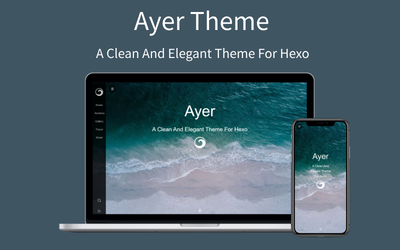

<p align="center"><a href="https://shen-yu.gitee.io" target="_blank" rel="noopener noreferrer"></a></p>

<h3 align="center">一个安静且优雅的 Hexo 主题</h3>

<p align="center">
  <a href="https://travis-ci.org/Shen-Yu/hexo-theme-ayer?branch=master" target="_blank" rel="noopener noreferrer">
    
  </a>
  <a href="http://standardjs.com" target="_blank" rel="noopener noreferrer">
    
  </a>
  <a href="https://gitter.im/hexo-theme-ayer/community?utm_source=badge&utm_medium=badge&utm_campaign=pr-badge" target="_blank" rel="noopener noreferrer">
    
  </a>
  <br>
  <a href="https://github.com/Shen-Yu/hexo-theme-ayer/releases" target="_blank" rel="noopener noreferrer">
    
  </a> 
 
  <a href="https://hexo.io/zh-cn/" target="_blank" rel="noopener noreferrer">
    
  </a>
 
</p>

---

:ocean: Ayer is a clean and elegant theme for Hexo, also fast, powerful and responsive. It contains many awesome features, It's perfect for your blog, "Ayer" means "water" in Malaysian and "yesterday" in Spanish. If you have any queries or advice during the process of using, Please contact me!  shenyu@hotmail.com

<b>注：收藏本主题请点右上角Star，谢谢~</b>

### [Preview 预览](https://shen-yu.gitee.io)

### [中文说明](https://shen-yu.gitee.io/2019/ayer/)

### [国内镜像](https://gitee.com/shen-yu/hexo-theme-ayer)



### Install

``` bash
$ git clone https://github.com/Shen-Yu/hexo-theme-ayer.git themes/ayer
```

### Enable

Modify `theme` setting in `_config.yml` to `ayer`

``` yml
theme: ayer
```

### Update

``` bash
cd themes/ayer
git pull
```

### Configuration

let me know if you have any questions.

``` yml
# Menu-Sidebar
menu:
  Home: /
  Archives: /archives
  Categories: /categories
  Tags: /tags
  Gallery: http://shenyu-vip.lofter.com
  Travel: /tags/旅行/
  About: /2019/about

# Subtitle and Typing animation
# https://github.com/mattboldt/typed.js
subtitle:
  enable: true
  text: A clean and elegant theme
  text2: It's perfect for your hexo blog
  text3: Have fun!  #Supports up to three lines of text
  startDelay: 0
  typeSpeed: 200
  loop: true
  backSpeed: 100
  showCursor: true

# Favicon and sidebar logo
favicon: /favicon.ico
logo: /images/ayer-side.svg

# Cover Setting 
# enable: [true|false]；path: [background-image]；logo: [cover-logo-image]
cover:
  enable: true
  path: /images/cover1.jpg  # there are some beautiful cover images in Ayer's directory: /source/images, choose your favorite image to replace it.
  logo: /images/ayer.svg

# ProgressBar  
progressBar: true

# Article Setting
# (Use this to excerpt if article is too long：<!--more-->)
excerpt_link: Read More...
excerpt_all: false

# Share
share_enable: true
# If you are not in China, maybe you prefer to set:false
share_china: true
# share text
share_text: Share
# search text
search_text: Search
# nav text
nav_text:
  page_prev: Prev page
  page_next: Next page
  post_prev: Newer posts
  post_next: Older posts

# Catalog in article
toc: true

# images in the article support click to fullscreen
image_viewer: true

# https://github.com/willin/hexo-wordcount
word_count:
  enable: true
  # only display in article page(not in index page)
  only_article_visit: true

# Reward Setting
# type：0-close reward； 1-only open in article which you have configured reward:true； 2-open in all articles
reward_type: 2
# reward word
reward_wording: 'Buy me a cup of coffee~'
# qrcode image path
alipay: /images/alipay.jpg
# qrcode image path
weixin: /images/wechat.jpg

# Copyright
# type：0-close all； 1-only display in article which you have configured copyright: true； 2-all articles
copyright_type: 2

# Search
# https://github.com/theme-next/hexo-generator-searchdb
search: true

# RSS
rss: /atom.xml

# DarkMode
darkmode: true

# ClickLove
clickLove: false

# articleWidth and sidebarWidth
layout:
  article_width: 80rem
  sidebar_width: 8rem

# Comment：1、Valine (recommended)；2、Gitalk

# 1、Valine [A fast, simple & powerful comment system](https://github.com/xCss/Valine)
# You need create leancloud account first (https://console.leancloud.app), then put the id|key in below.
leancloud:  
  enable: true
  app_id: #
  app_key: #
# Valine Setting
valine:
  enable: true 
  verify: false # comment verify
  avatar: mp # (https://valine.js.org/avatar.html)
  placeholder: Add some comments to my article~ # placeholder

# 2、Gitalk(https://github.com/gitalk/gitalk)
gitalk:
  enable: false # true
  clientID: # GitHub Application Client ID
  clientSecret: # Client Secret
  repo: # Repository name
  owner: # GitHub ID
  admin: # GitHub ID

# GitHub Ribbons(https://github.blog/2008-12-19-github-ribbons/)
github: 
  # (Set false if you don't need)
  url: https://github.com/Shen-Yu/hexo-theme-ayer

# pv&uv statistics
busuanzi:
  enable: true

# cnzz statistics
cnzz:
  enable: true
  url: #

# Google Analytics
google_analytics: ''
# Baidu Analytics
baidu_analytics: ''

# Mathjax Support
mathjax: true

# Katex Support
katex:
  enable: false # true
  allpost: true
  copy_tex: false

# since year
since: 2019

# pageFooter (Set true can let more people know this theme, Thanks!)
pageFooter: true
```

### Plugins

+ [hexo-generator-search](https://github.com/wzpan/hexo-generator-search) (for Local Search)
	
  ```yml
  $ npm install hexo-generator-searchdb --save
  ```
  Then add the plugin configuration in hexo's configuration file `_config.yml` (note: not the theme's configuration file):
  
  ```yml
  # Hexo-generator-search
  search:
    path: search.xml
    field: post
    format: html
  ```

+ [hexo-generate-feed](https://github.com/hexojs/hexo-generator-feed) (for RSS)

  ```yml
  $ npm install hexo-generator-feed --save
  ```
  
  Then add the plugin configuration in hexo's configuration file `_config.yml` (note: not the theme's configuration file):
  
  ```yml
  feed:m 
      type: atom
      path: atom.xml
      limit: 20
      hub:
      content:
      content_limit: 140
      content_limit_delim: ' '
      order_by: -date	
  ```
  
+ [hexo-generator-index-pin-top](https://github.com/netcan/hexo-generator-index-pin-top) (for Sticky Post)
	
	``` bash
  $ npm uninstall hexo-generator-index --save
  $ npm install hexo-generator-index-pin-top --save
  ```
### Categories
``` bash
  hexo new page categories
```
Then paste following codes to file: /source/categories/index.md
``` md
---
title: categories
type: categories
layout: "categories"
---
```

### Tags
Same as categories.

### Gallery
Need to write in the head of the markdown, this is not a good way to write, I hope to get a better way to write on github.

``` md
---
title: Gallery

albums: [
        ["img_url","img_caption"],
        ["img_url","img_caption"]
        ]
---
```

### Toc

Use Tocbot to parse the title tags (h1~h6) in the content and insert the directory. 

+ ayer/_config.yml

	``` bash
	# Toc
  toc: true
	```
+ If Toc is turned on in ayer/_config.yml, then Tocbot will generate a Toc article directory in the title tag of each blog parsing content, but not all blogs require Toc, so in the Front-matter section of markdown Can be closed:

	``` md
	---
  no_toc: true
  ---
	```

---

<br/>
<a src="https://github.com/Shen-Yu/hexo-theme-ayer">Ayer</a> by <a  href="https://github.com/Shen-Yu">Eric-Shen</a> is licensed under  <a rel="license" href="https://www.mit-license.org/">MIT</a>.
